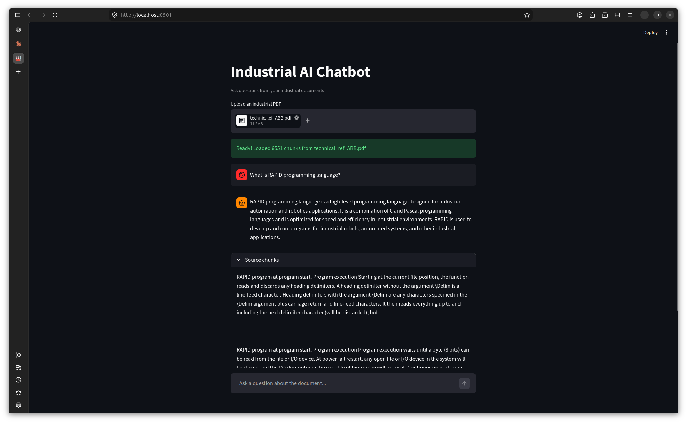
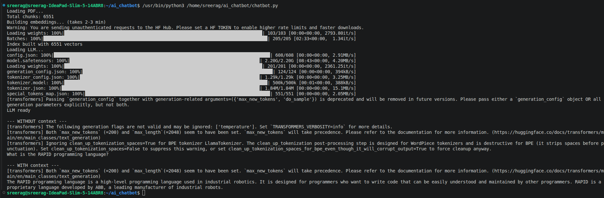

# Industrial AI Chatbot

An AI-powered chatbot for industrial documentation built using Retrieval-Augmented Generation (RAG). The application allows users to upload industrial PDF documents and ask natural language questions, with answers grounded in the document content through semantic retrieval.

## Features

* Upload and analyze industrial PDF documents
* Automatic text extraction and chunking
* Semantic search using sentence embeddings
* Context-aware question answering
* Source chunk transparency for answer verification
* Reduced hallucinations through Retrieval-Augmented Generation (RAG)
* Interactive web interface built with Streamlit

## Web Application Demo



*Local Streamlit application demonstrating PDF upload, semantic retrieval, and document-based question answering.*

## Hallucination Reduction with RAG



*Comparison of responses generated with and without retrieved document context. By grounding the language model with relevant document chunks, the system produces more accurate and reliable answers while reducing hallucinations.*

## System Architecture

```text
PDF Upload
    ↓
Text Extraction (PyMuPDF)
    ↓
Text Chunking
    ↓
Sentence Embeddings
    ↓
FAISS Vector Index
    ↓
Semantic Retrieval
    ↓
Context Construction
    ↓
TinyLlama Response Generation
    ↓
Answer + Source Chunks
```

## Technologies Used

* Python
* Streamlit
* PyMuPDF
* Sentence Transformers
* FAISS
* LangChain Text Splitters
* Hugging Face Transformers
* TinyLlama 1.1B Chat

## Installation

Clone the repository:

```bash
git clone <repository-url>
cd industrial-ai-chatbot
```

Install dependencies:

```bash
pip install -r requirements.txt
```

## Run the Application

```bash
streamlit run chatbot.py
```

The application will open in your browser, where you can upload a PDF document and start asking questions.

## How It Works

1. The user uploads an industrial PDF document.
2. The document text is extracted and split into manageable chunks.
3. Each chunk is converted into vector embeddings using Sentence Transformers.
4. The embeddings are stored in a FAISS vector index.
5. When a question is asked, the most relevant chunks are retrieved through semantic similarity search.
6. Retrieved context is provided to TinyLlama for answer generation.
7. The generated answer and supporting source chunks are displayed to the user.

## Project Objective

The goal of this project is to demonstrate how Retrieval-Augmented Generation can improve the reliability of large language models when working with domain-specific industrial documentation by grounding responses in relevant source material.

## Author

Sreerag KS
